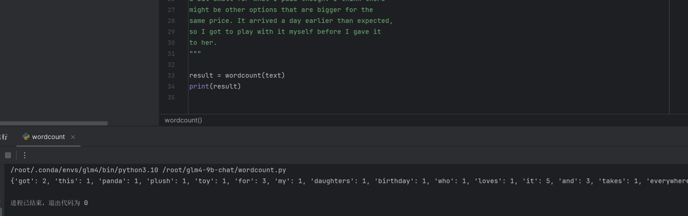

# Python 实现wordcount
    # import re
    from collections import defaultdict

    def wordcount(text):
    # 去掉标点符号并将所有单词转换成小写
    text = text.lower()
    text = re.sub(r'[^\w\s]', '', text)

    # 使用正则表达式来匹配单词
    words = re.findall(r'\b\w+\b', text)

    # 使用 defaultdict 来统计每个单词的出现次数
    word_count = defaultdict(int)

    for word in words:
        word_count[word] += 1

    return dict(word_count)
# 运行结果

